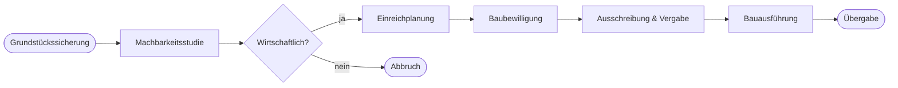

# Diagrams and Schematics (local only)

## Overview

Turn concepts, workflows and relationships into clear diagrams. Claude writes
the diagram source itself - no image-generation API is called.

## Privacy rule: no data leaves the machine

- **Never** send diagram content, descriptions or images to an external service
  (no OpenRouter, Gemini, OpenAI, online Mermaid/PlantUML/Kroki renderers, etc.).
- Only use tools that run locally.

## Output formats

Choose the simplest format that fits:

| Format | When to use | How |
|--------|-------------|-----|
| **Mermaid** (default) | Flowcharts, sequences, Gantt/timelines, org charts, state diagrams | Write a ```` ```mermaid ```` block or a `.mmd` file. Renders in GitHub, GitLab, Obsidian, VS Code preview. |
| **SVG** | Custom layouts, site/area schematics, publication figures | Write the `.svg` by hand: `viewBox`, grouped shapes, readable text, no external fonts or links. |
| **Graphviz DOT** | Large dependency or network graphs | Write a `.dot` file; render locally with `dot -Tsvg in.dot -o out.svg` if Graphviz is installed (`apt-get install graphviz`). |

Optional local rendering of Mermaid to SVG/PNG: `npx @mermaid-js/mermaid-cli -i in.mmd -o out.svg`
(runs a local headless browser; nothing is uploaded).

## Workflow

1. Clarify purpose and audience (internal note, presentation, report).
2. Identify nodes, relationships and the reading direction (left-to-right or top-to-bottom).
3. Draft the diagram source; keep to roughly 5-15 elements per diagram - split if larger.
4. Apply the style rules below.
5. Save next to the document it belongs to (e.g. `figures/<name>.mmd` or `.svg`) and reference it.

## Style rules

- One idea per diagram; a short title that states it.
- Consistent shapes: rectangle = step/activity, diamond = decision, rounded = start/end.
- Label every arrow whose meaning is not obvious.
- Colorblind-safe palette (e.g. Okabe-Ito: `#0072B2`, `#E69F00`, `#009E73`, `#D55E00`, `#CC79A7`);
  never encode meaning by color alone.
- Minimum text size equivalent to 8 pt in the final output; high contrast on white.

## Example (Mermaid)



## Resources

- `references/best_practices.md` - publication standards, accessibility, typography,
  common pitfalls and a quality checklist.
